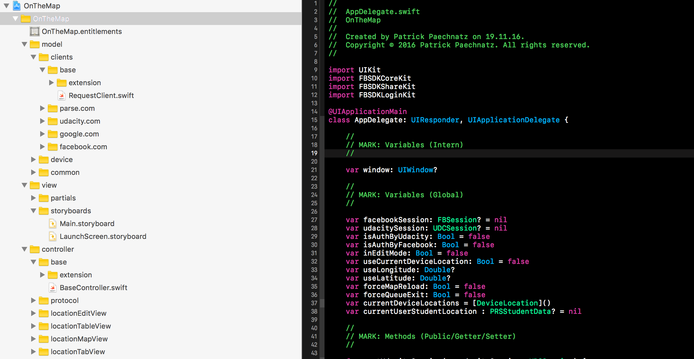
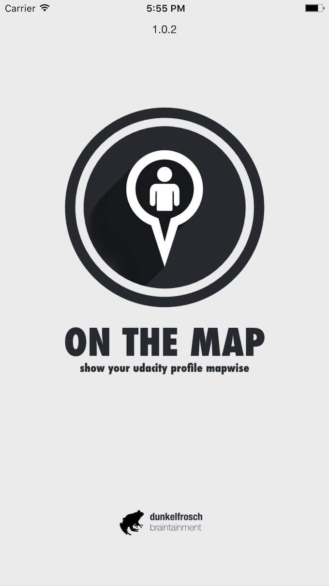
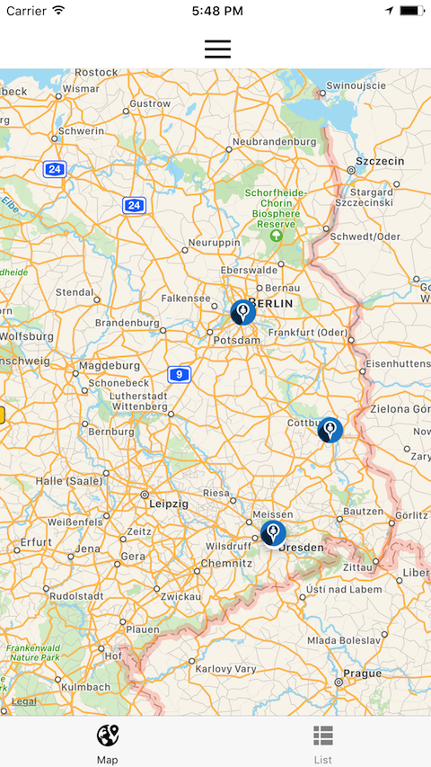
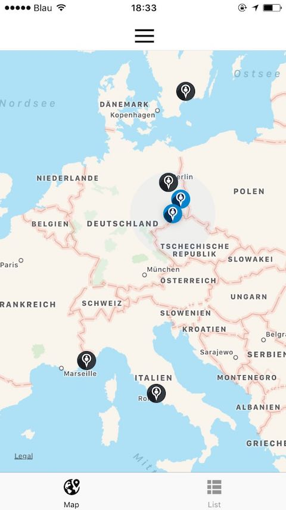
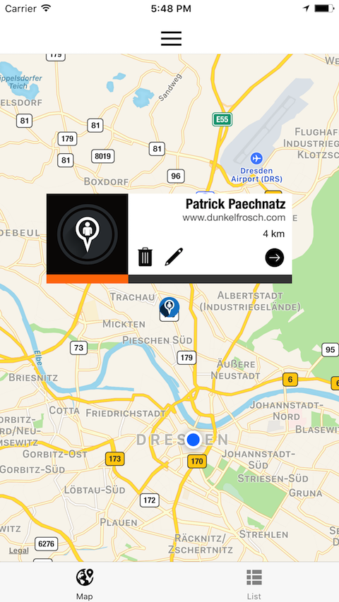
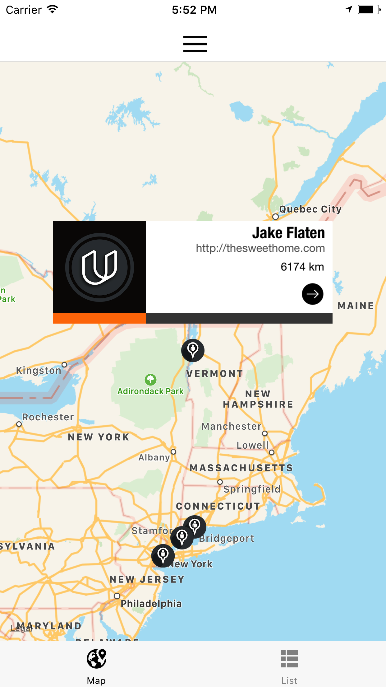
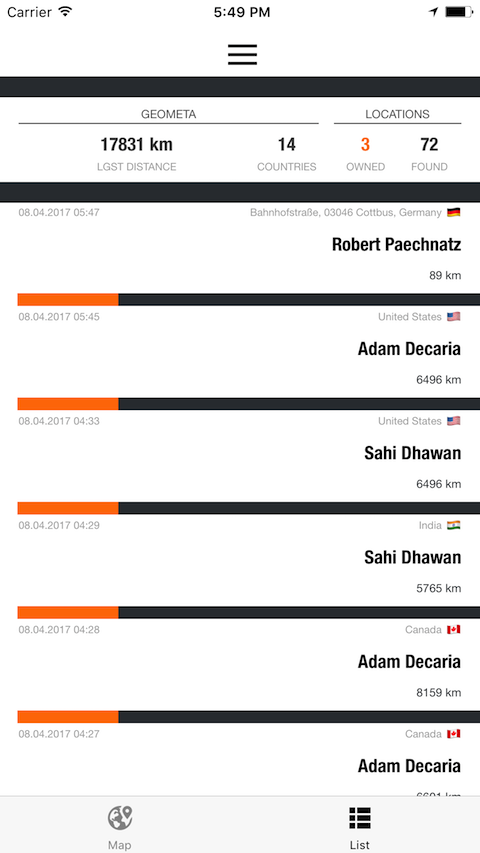
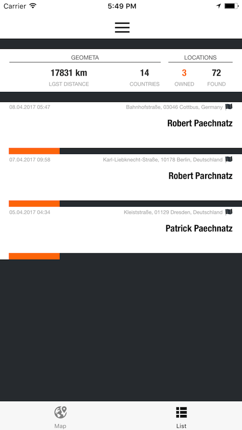
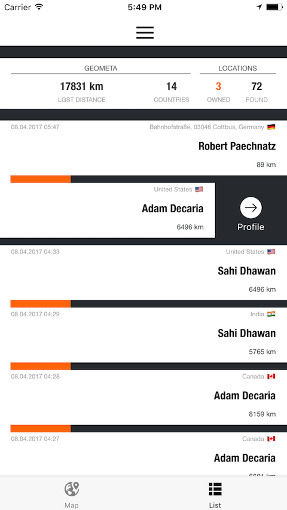
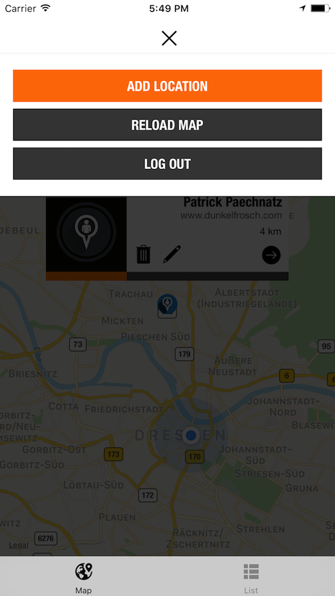

# ON-THE-MAP
## udacity.com student submission

*This repository contains the project submission for udacity.com project work  "OnTheMap" during my iOS developer certification program (course ND003).*

## App Description

„On The Map“ (OTM) is an iOS 10.3 mobile app that shows information posted by other students on a map. The map contains pins that show the location where other students have been reported to be studying. By tapping on a pin users can see an URL posted by the student belonging to that pin. The user is able to add their own data by posting a string that can be reverse geocoded to a location, and a URL.

## App Specifications

OTM master (currently 1.0.3) using the latest XCode 8.3 (8E162) version and will be able to run under iOS version 9.n up to the latest iOS version 10.n
 
OTM uses 4 API EndPoints by using iOS native http session-handler:

- udacity.com
- parse.com (udacity clone)
- facebook.com
- google maps

OTM uses 3rd Party Libraries for better UX/UI behavior and graphical elements from vectorstock. A complete list of used libraries can be found inside the projects [COPYRIGHT.md](COPYRIGHT.md) file.

## App Features

OTM uses some additional features. The app uses a dedicated process pipe to enhance the fetched student meta information entity by measuring the distance between the students and the app running device. In addition to this information the country and corresponding flag of each student will also be fetched and added to the map annotation and listView cell element.

## App Structure

OTM is following the MVC pattern by structural and logical definition. The app is using dedicated view partials instead of base sub views of table cells and annotations.

 

### Login
*all users of this app have to be authenticated against the udacity.com network using their student credentials or their facebook login using OAuth-2*

Splash Screen             |  Login-View
:-------------------------:|:-------------------------:
  |  

### MapView
*Each student location is tagged on the iOS map with a specific pin - your own locations will be blue, locations by other users will feature a black pin color*

MapView Normal             |  MapView ZoomOut
:-------------------------:|:-------------------------:
  |  

### Map Annotation
*You can click the annotation pins to bring up a detailed student meta view. You can edit your locations or delete them. Other student locations are linked to the provided student url*

Own Annotation             |  Foreign Annotation
:-------------------------:|:-------------------------:
  |  

### ListView
*For a complete view of the map, you can switch to listView. At the top of the listView you can see a row containing statistic information about the general number of locations found, the count of your locations, the largest distance between your device and another student as well as the numbers of unique countries identified*

ListView of Locations             |  ListView of own Locations
:-------------------------:|:-------------------------:
  |  

### ListView Controls
*Behind each of the sliding rows you can find a menu. If this location is a location belonging to you, you are able to edit, delete or jump to your provided mediaURL / student location profile. If the row entry is a location of  an other student you can visit the corresponding student profile by click on the link*

ShortMenu to student             |  ShortMenu to your location
:-------------------------:|:-------------------------:
  |  

### App/Map/ListMenu
*The menu in map- and listView allows you to add new locations, filter your list results or logOut from the OTM app*

Map Menu             |  List Menu
:-------------------------:|:-------------------------:
  |  

## Keywords

swift-3, swift, udacity, extension, uikit, mapkit, foundation, swift-app

## Releases

OTM is currently available in [4 releases](https://github.com/paterik/udacity-ios-on-the-map/releases) and will be following the Sequence-based version pattern _major.minor[.maintenance[.build]]_. The Build will be auto-generated during each XCode-Build-Prozess using 3rd-Party-Script [xcode-version-bump.sh](https://gist.github.com/sekati/3172554) of Jason Horwitz (sekati). The build number won’t be part of my semantic versioning. 

## Changelog

All notable changes of OnTheMap release series are documented in project [CHANGELOG.md](CHANGELOG.md) file using the [Keep a CHANGELOG](http://keepachangelog.com/) prtheinciples. The changelog documentation starts with version 0.9.9 (2016-11-19). The latest „reviewed“ version of OTM met the specifications to accomplish the course sub goal. 

## License-Term

Copyright (c) 2016-2017 Patrick Paechnatz <patrick.paechnatz@gmail.com>
                                                                           
Permission is hereby granted,  free of charge,  to any  person obtaining a  copy of this software and associated documentation files (the "Software"), to deal in the Software without restriction,  including without limitation the rights to use,  copy, modify, merge, publish,  distribute, sublicense, and/or sell copies  of the  Software,  and to permit  persons to whom  the Software is furnished to do so, subject to the following conditions:       
                                                                           
The above copyright notice and this permission notice shall be included in all copies or substantial portions of the Software.
                                                                           
THE SOFTWARE IS PROVIDED "AS IS", WITHOUT WARRANTY OF ANY KIND, EXPRESS OR IMPLIED, INCLUDING  BUT NOT  LIMITED TO THE WARRANTIES OF MERCHANTABILITY, FITNESS FOR A PARTICULAR  PURPOSE AND  NONINFRINGEMENT.  IN NO EVENT SHALL THE AUTHORS OR COPYRIGHT HOLDERS BE LIABLE FOR ANY CLAIM, DAMAGES OR OTHER LIABILITY,  WHETHER IN AN ACTION OF CONTRACT,  TORT OR OTHERWISE,  ARISING FROM,  OUT OF  OR IN CONNECTION  WITH THE  SOFTWARE  OR THE  USE OR  OTHER DEALINGS IN THE SOFTWARE.